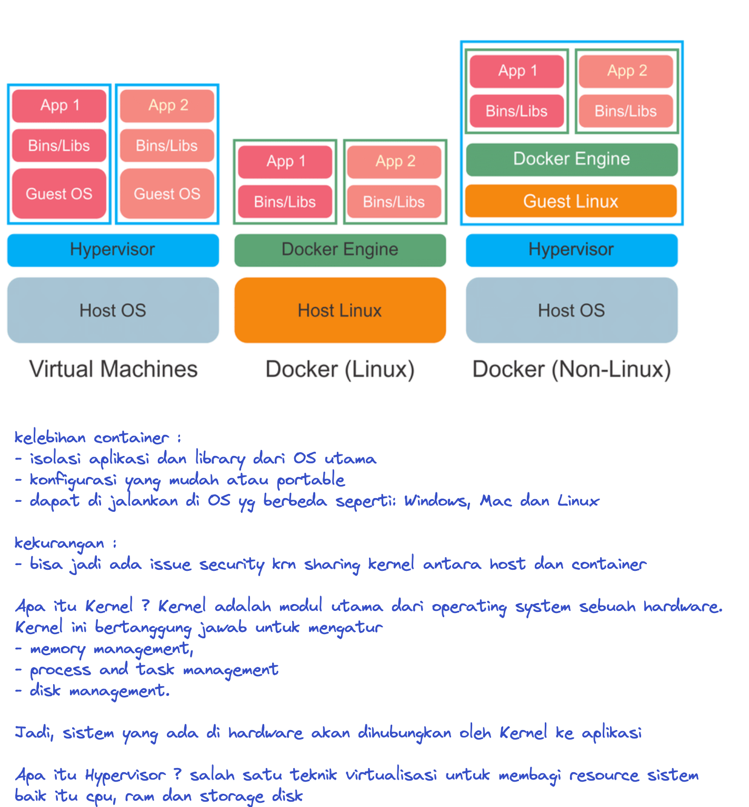
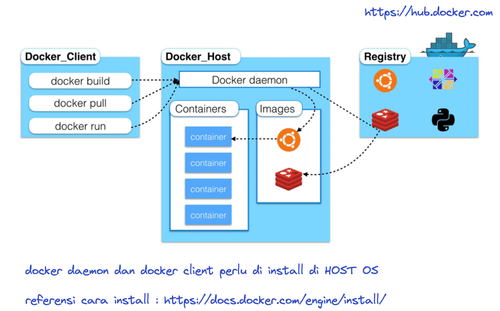

Kali ini kita akan membahas apa itu docker serta kelebihan dan kekurangannya.

Docker adalah aplikasi untuk menyatukan berbagai file software dan pendukungnya dalam sebuah wadah (container) agar memudahkan proses pengembangan software.

Nah, mengapa kita perlu menggunakan container seperti yang ditawarkan Docker?

Dalam pengembangan aplikasi, developer memerlukan virtualisasi di server agar aplikasi bisa berjalan di berbagai platform dengan konfigurasi hardware yang berbeda-beda.

Sayangnya, ketika menggunakan virtualisasi, kita harus menyiapkan satu sistem operasi secara penuh dan alokasi resource.

Container bisa digunakan sebagai alternatif virtualisasi sehingga tidak perlu menyiapkan sistem operasi secara penuh. 

Dengan container, ukuran file menjadi lebih kecil dibandingkan virtualisasi yang biasa digunakan

[https://docs.docker.com/engine/install](https://docs.docker.com/engine/install)
